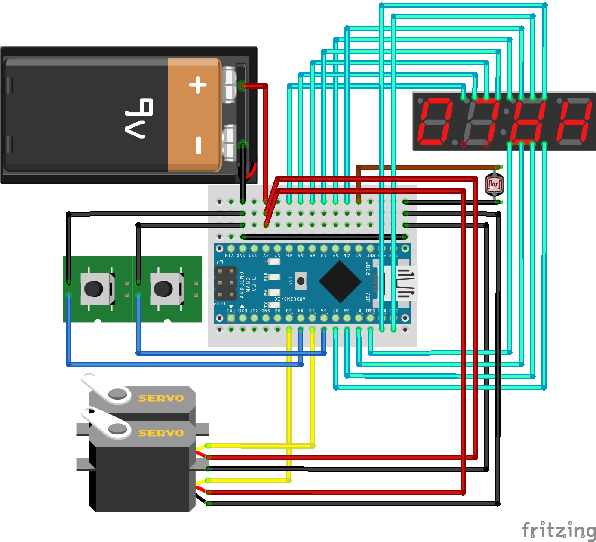

### Circuits

### Parts
* Arduino NANO
* SG90 x 2
* CDS Photo Transistor
* Tact Switches x 2
* 7 segment - 4 digit
* 9V batt.

### Details
---
* SG90 Pins - D3(L), D5(R) (PWM)
* Tact Switch Pins - D4(L), D6(R)
* CDS Pin - A0
* 7 Segment Pins
  * Segment = D11 (a), D12 (b), A1 (c), A2 (d), A3 (e), A4 (f), A5 (g), A6 (dp)  
  * Digits = D7 (d1), D8 (d2), D9 (d3), D10 (d4)  
* Tact Switch와 CDS Transistor에는 NANO 내부의 Pullup Resistor 사용. (No Need 10k Resistor)